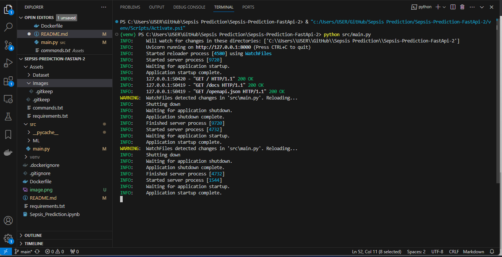

# Sepsis Prediction API Using Fast Api

Sepsis is a critical medical condition that requires prompt diagnosis and intervention. This project leverages FastAPI to provide a robust and efficient solution for predicting sepsis. Fast API is designed to predict the likelihood of sepsis based on various input parameters. The underlying model is trained to provide accurate predictions, aiding healthcare professionals in making timely and informed decisions. The repository includes a demo application with comprehensive API documentation, making it easy to explore and interact with the predictive model.

## Project Structure Overview
1. src Folder:
* The src folder contains the source code of the FastAPI application.
* It typically includes the main application file, such as main.py, where the FastAPI instance is created, and routes and endpoints are defined.
* It may also include additional modules or packages for organizing the code logically.

2. Assets Folder:

* The Assets folder often holds external files or resources that are used by the application.
* In a machine learning context, this folder might store pre-trained models, data files, or any other assets required for the application to function.

3. Dockerfile:

* The Dockerfile is a configuration file used to build a Docker container for the FastAPI application.
* It specifies the base image, sets up the working directory, installs dependencies, copies the application code into the container, and defines the command to run the application.
* Dockerfiles are crucial for creating reproducible and portable environments.

## Setup
Before running the evaluation locally, ensure you have Python 3 installed. Create and activate a virtual environment, then install the required packages listed in requirements.txt.
Follow the steps below:

Windows:
``````
  python -m venv venv; venv\Scripts\activate; python -m pip install -q --upgrade pip; python -m pip install -qr requirements.txt  
``````
Linux & MacOs:
``````
  python3 -m venv venv; source venv/bin/activate; python -m pip install -q --upgrade pip; python -m pip install -qr requirements.txt  
``````

The both long command-lines have a same structure, they pipe multiple commands using the symbol ; but you may manually execute them one after another.

Create the Python's virtual environment that isolates the required libraries of the project to avoid conflicts;
Activate the Python's virtual environment so that the Python kernel & libraries will be those of the isolated environment;
Upgrade Pip, the installed libraries/packages manager to have the up-to-date version that will work correctly;
Install the required libraries/packages listed in the requirements.txt file so that it will be allow to import them into the python's scripts and notebooks without any issue.
NB: For MacOs users, please install Xcode if you have an issue.


## FastAPI:
To run this project, use the following command at the repository root:

``````
python src/main.py
``````
The following is the expected output:



Go to your browser at the following address, to explore the api's documentation, which appears like below :


Follwoo
http://127.0.0.1:8000/docs

## Contribution
Feel free to contribute to the project by providing feedback, reporting issues, or submitting pull requests. Together, we can enhance the capabilities of this Sepsis Prediction Fast API.
